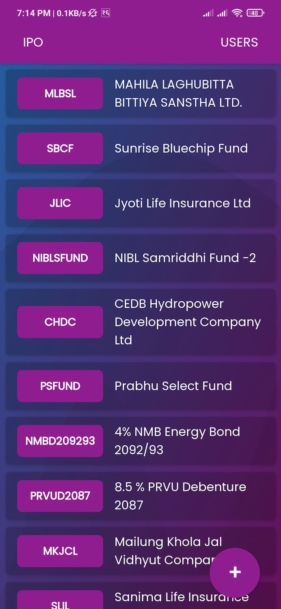
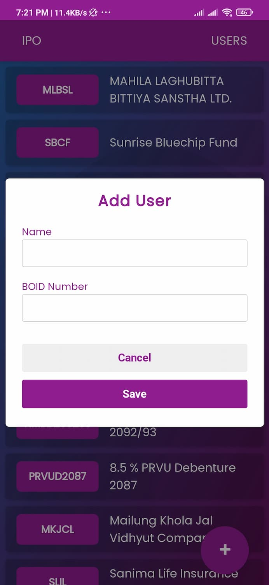
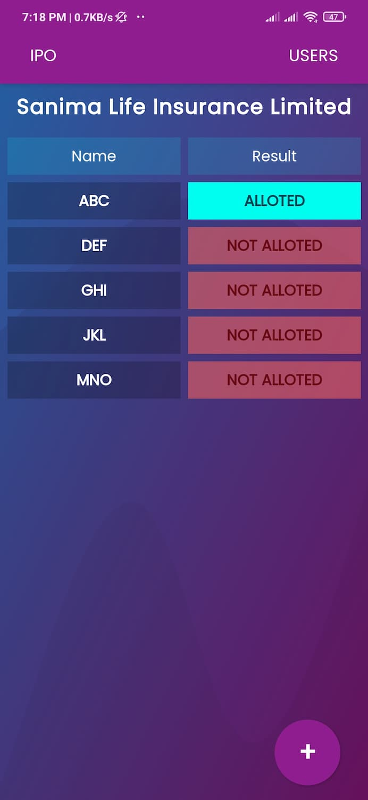

# Iporesult

It is an web application that you can install on your mobile by adding it to home screen. You can view Iporesults of several family members with one click.

  
  
  
 

## Installation And Usage

You need not to install it to home screen to use it, but adding it to home screen (installing it ) will be convineint.

### Installation

> 1. Visit <a class="display:inline" href="https://iporesults.netlify.app">IpoResults</a>.
> 2. It shows <strong>Do you want to add to home screen?</strong> . You need to add it to home screen, if you want to use it like an app.
> 3. If it doesn't you can go to chrome menus and select options Add to Home Screen or Install App whichever appears there.

### Usage

> 1.  You need to add user with any name you ant and his/her boid as by clicking <strong>+</strong> button below.
> 2.  You can and edit details of all added users in Users tab.
> 3.  Now you can click on the IpoList on the home page to see results of all users at a click.

## Warning

You need to set all the BOID correct or you will not get result for any of the users.

## Further

Use this app for your personal purpose only. Do not try to use it for any commercial purpose.
